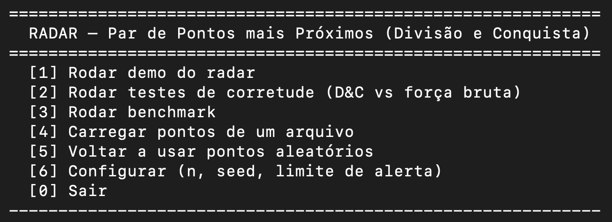
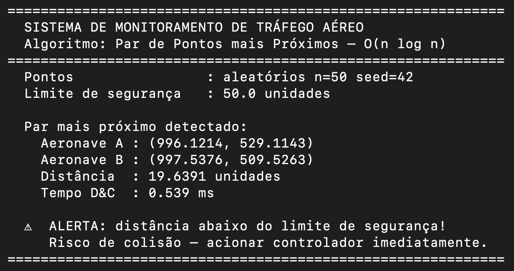
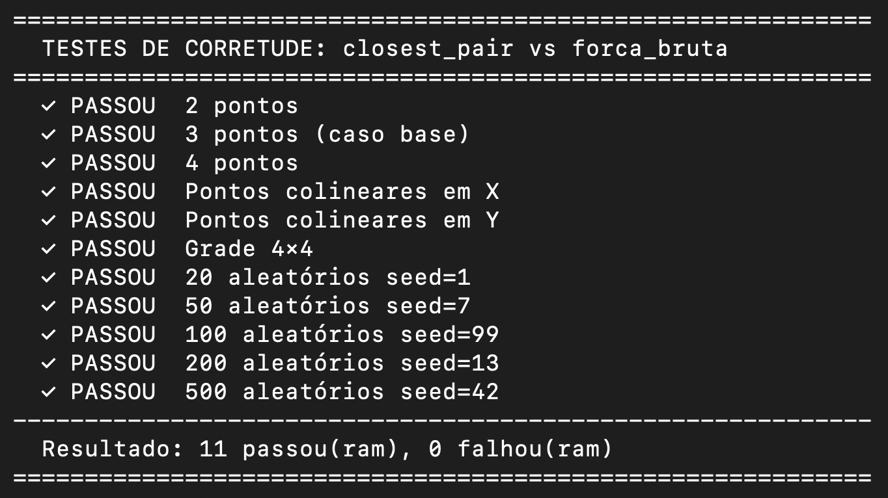
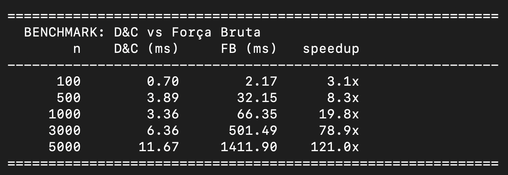

# G10 — Par de Pontos mais Próximos (Divisão e Conquista)

Trabalho da disciplina **Projeto de Algoritmos (PA — 2026.1)**, UnB.<br>
Tema da unidade: **Divisão e Conquista**.<br>

## Alunos
|Matrícula | Aluno |
| :-------: | :------------------------------: |
| 23/1038072  |  Gabriel Dantas Bevilaqua Mendes |
| 23/1026483  |  Maria Eduarda de Amorim Galdino |


---
## Link do Vídeo 
[Vídeo](https://youtu.be/__HO0WAcV2s)

--- 
## Sobre

Um **sistema de controle de tráfego aéreo** (ou um radar de aproximação)
acompanha, a cada instante, a posição de **centenas ou milhares de
aeronaves** sobre uma região. Em coordenadas de um mapa, cada aeronave é
um **ponto `(x, y)`** no plano.

A pergunta operacional mais crítica é:
**quais são as duas aeronaves mais próximas uma da outra agora?**
Esse par é justamente o de **maior risco de colisão** — é o que o
controlador precisa monitorar primeiro e, se a distância cair abaixo de
um limite de segurança, o sistema emite um **alerta**.

Matematicamente, isso é o problema clássico do
**par de pontos mais próximos**: dado um conjunto de `n` pontos no
plano, encontrar o par `(p, q)` cuja distância euclidiana é a menor de
todas.

### Por que não basta a força bruta?

A solução ingênua compara todos os pares: para `n` aeronaves são
`n(n−1)/2` comparações, ou seja **O(n²)**. Com `n = 10.000` isso dá
~50 milhões de comparações por atualização — inviável para um radar que
precisa recalcular várias vezes por segundo.

A estratégia de **Divisão e Conquista** resolve o mesmo problema em
**O(n log n)**, viabilizando o monitoramento em tempo real. O tema
motiva diretamente a escolha do algoritmo.

---

## Como rodar

Requisitos: **Python 3.8+** (sem dependências externas).

```bash
cd app

# Demo padrão: 50 aeronaves
python3 main.py

# Mais aeronaves
python3 main.py --n 500

# Demo + bateria de testes de corretude (D&C vs força bruta)
python3 main.py --n 100 --testes

# Demo + benchmark de tempo (D&C vs força bruta em vários tamanhos)
python3 main.py --benchmark
```

---

## Screenshots

### Menu Principal 


### Demo do Radar



### Testes de Corretude 


### Benchmark


---

## Estrutura do projeto

```
app/
├── base.py           # distância, força bruta (caso base), entrada de dados
├── closest_pair.py   # núcleo de Divisão e Conquista (recursão + faixa central)
└── main.py           # CLI: demo do radar, testes de corretude e benchmark
```

### base.py
- `distancia(p, q)` — distância euclidiana.
- `forca_bruta(pontos)` — O(n²). Também é o **caso base** da recursão (n ≤ 3).
- `gerar_pontos(n, seed=...)` — gera n pontos aleatórios (aeronaves).
- `ler_pontos(caminho)` — lê pontos de um arquivo `.txt`.
- `ordenar_por_x` / `ordenar_por_y` — pré-processamento Px / Py.

### closest_pair.py
- `closest_pair(pontos)` — API pública, O(n log n).
- `_closest_pair_rec(px, py)` — recursão sobre as duas metades.
- `_verificar_faixa(faixa, d)` — combinação na faixa central de largura 2d.

### main.py
CLI com três modos:
- **demo** (default): cenário do radar, mostra par mais próximo + alerta.
- **`--testes`**: compara D&C com força bruta em vários casos.
- **`--benchmark`**: mede tempo dos dois métodos para n crescente.

---

## O algoritmo passo a passo

1. **Pré-processamento.** Ordenar os pontos por X (`Px`) e por Y (`Py`).
   Custo único O(n log n).
2. **Caso base.** Se `n ≤ 3`, resolver por força bruta.
3. **Divisão.** Achar a coordenada mediana `mx` em X. Dividir `Px` ao
   meio: metades esquerda (`Pe`) e direita (`Pd`). Construir `Pe_y` e
   `Pd_y` filtrando `Py` em uma passada — assim cada metade já vem
   ordenada por Y, sem reordenar.
4. **Conquista.** Recursivamente, obter o par mais próximo em cada
   metade. Seja `d = min(d_esq, d_dir)`.
5. **Combinação — faixa central.** O par mais próximo global pode ter
   um ponto de cada lado da linha `x = mx`, mas, se existir, ele tem que
   estar dentro de uma faixa vertical de largura `2d` em torno de `mx`.
   Pega-se essa faixa **já ordenada por Y** e, para cada ponto, basta
   compará-lo com **no máximo 7 vizinhos seguintes** na ordem por Y
   (prova clássica: dentro de um retângulo `2d × d` cabem no máximo 8
   pontos com distância mútua ≥ d).
6. **Resposta.** Devolve o menor entre `d_esq`, `d_dir` e o melhor par
   encontrado na faixa.

---

## Análise de complexidade

| Etapa                                  | Custo            |
|----------------------------------------|------------------|
| Ordenação inicial por X e por Y        | O(n log n)       |
| Divisão (slicing + filtro em Py)       | O(n) por nível   |
| Combinação (faixa: ≤ 7 vizinhos cada)  | O(n) por nível   |
| Recursão                                | T(n) = 2·T(n/2) + O(n) |

Pela relação de recorrência **T(n) = 2T(n/2) + O(n)**, pelo Teorema
Mestre obtemos **T(n) = O(n log n)**.

Comparação:

| Método                     | Complexidade  |
|----------------------------|---------------|
| Força bruta                | **O(n²)**     |
| Divisão e conquista (este) | **O(n log n)**|

Em testes locais (`python3 main.py --benchmark`) o ganho de velocidade
fica visível já a partir de `n ≈ 1000` e cresce rapidamente com `n`.

---

## Testes de corretude

`python3 main.py --testes` executa uma bateria comparando a saída do
algoritmo D&C com a da força bruta em casos diversos:

- 2, 3 e 4 pontos (cobrem o caso base)
- pontos colineares em X e em Y
- grade regular 4×4
- conjuntos aleatórios de 20, 50, 100, 200 e 500 pontos

Critério: a **distância** retornada por `closest_pair` deve ser igual à
de `forca_bruta` em todos os casos (tolerância 1e-9).

---

## Divisão de tarefas

Trabalho em dupla, com cada arquivo sob responsabilidade de **uma única
pessoa** (sem co-autoria por arquivo).

### Pessoa 1 — Base, dados e documentação
- `app/base.py` (distância, força bruta, geração e leitura de pontos,
  pré-processamento Px/Py)
- `README.md` (este documento)

### Pessoa 2 — Núcleo de Divisão e Conquista e CLI
- `app/closest_pair.py` (recursão + faixa central)
- `app/main.py` (CLI: demo do radar, testes de corretude, benchmark)

**Ponto de integração.** `closest_pair` chama `forca_bruta` (caso base)
e `distancia` de `base.py`. `main` usa `gerar_pontos`, `forca_bruta` e
`distancia` da base, e `closest_pair` do núcleo D&C.

---
